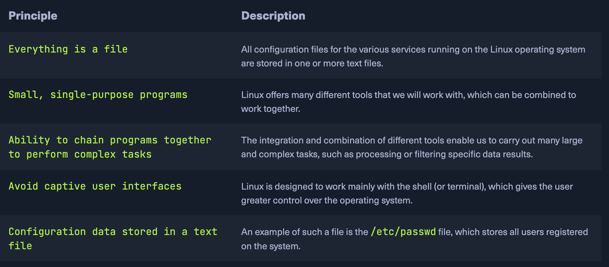
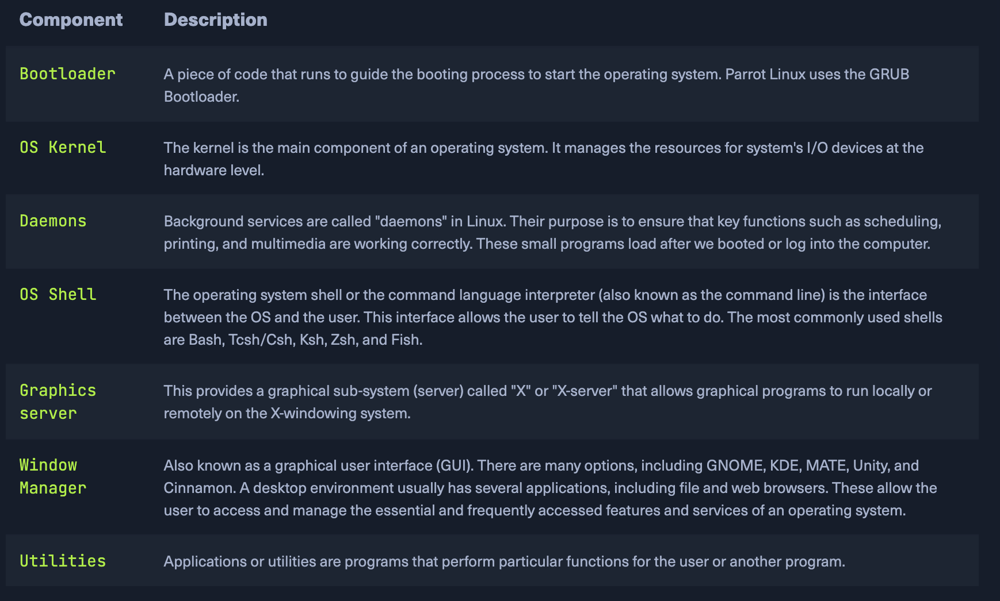
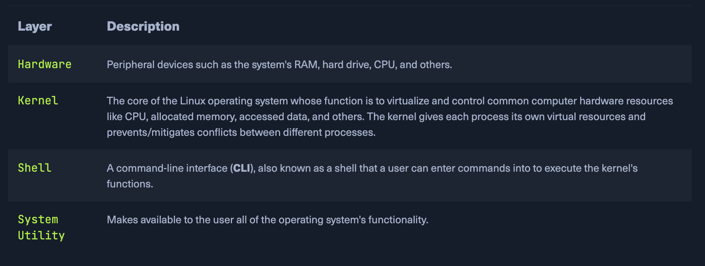
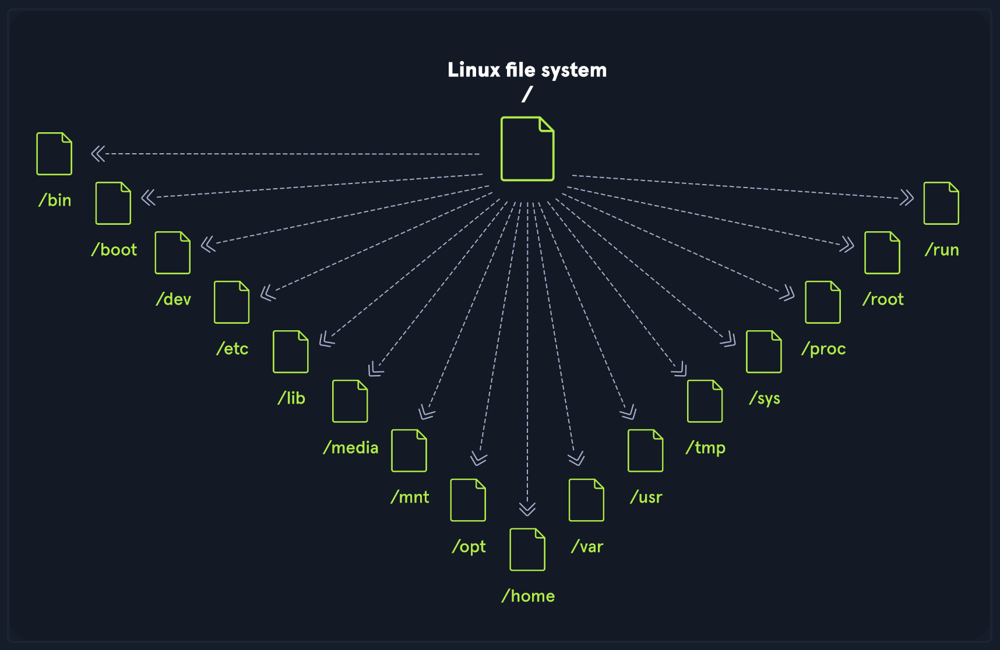
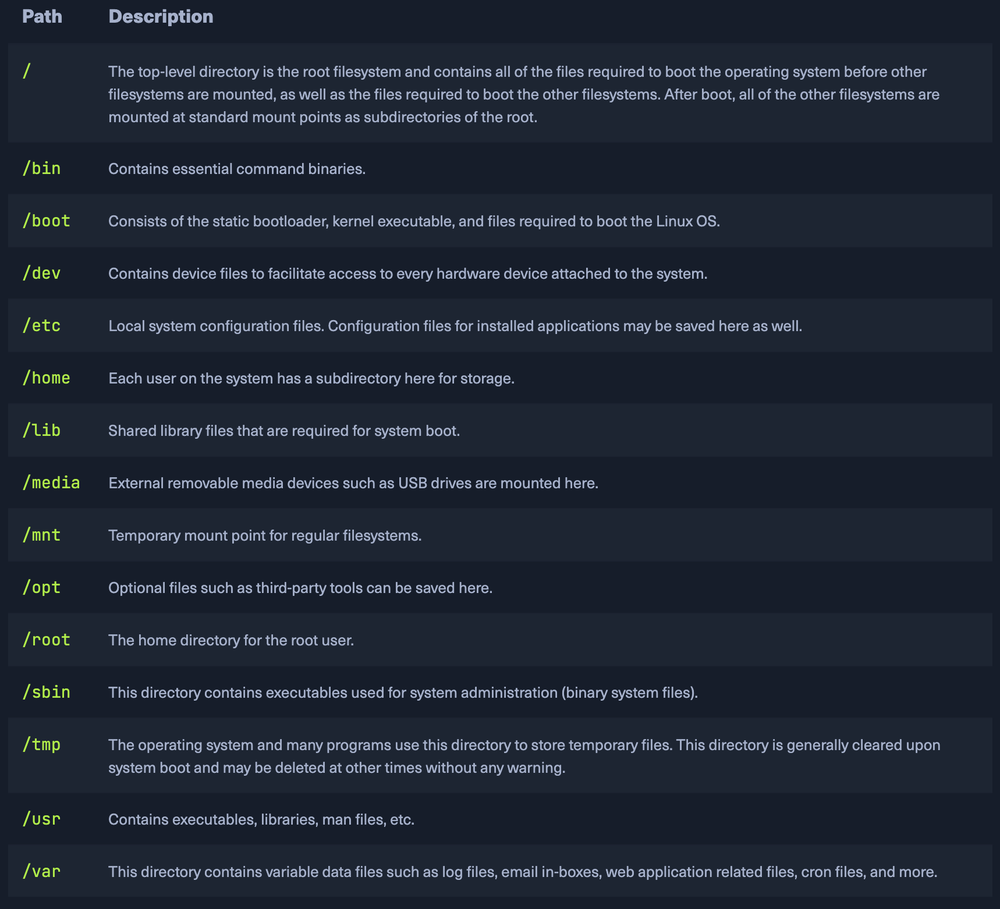
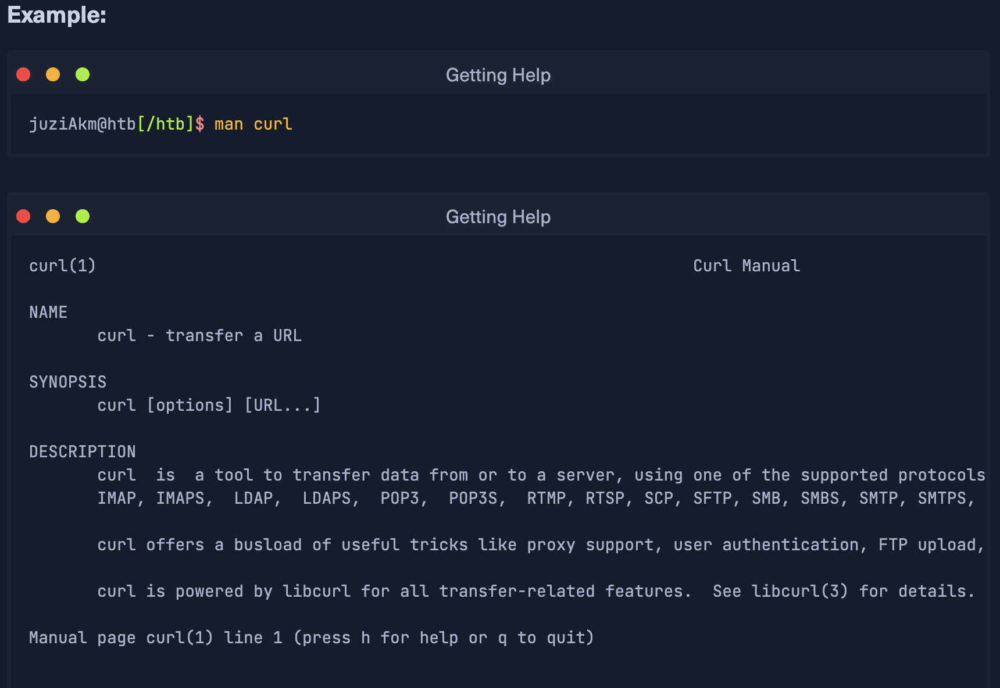
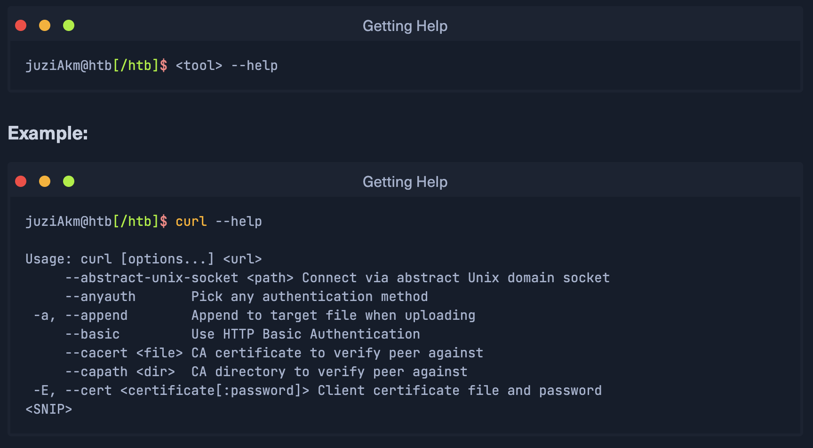
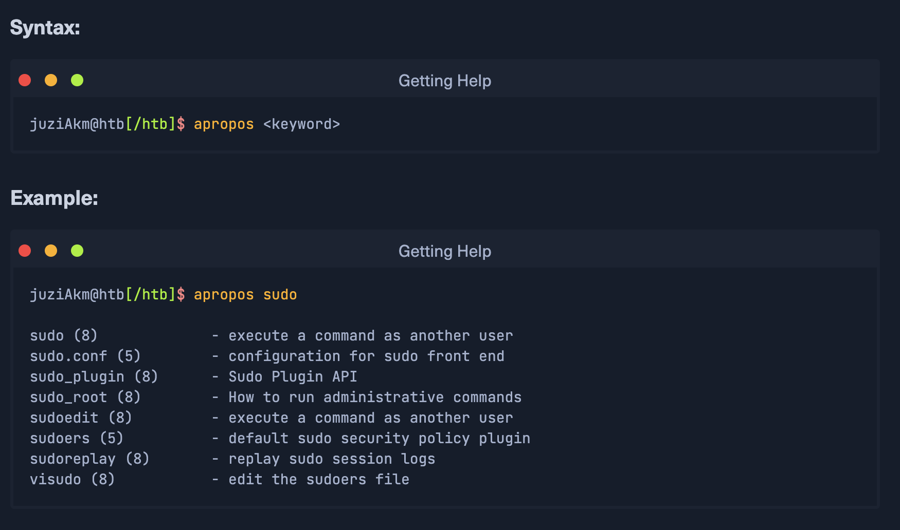

# Learning Dependecies

## 19th November 2024
Today, I learned about **Linux**, **Windows OS**, and **Virtual Private Server**. How to install them and make basic configurations. 

### Key Takeaways
- **Linux history**: At first was a personal project started in 1991 by a finnish student Linus Torvalds.
- **Linux distributions**: Available in over 600 distributions.
- **Windows**: Installed and set up configuration. 
- **Virtual Private Server**: is an isolated environment created on a physical server using virtualization technology. A VPS is fundamentally part of IaaS solutions.   

### Reflections
Linux is generally considered more secure than other operating systems, and while it has many kernel vulnerabilities in the past, it is becoming less and less frequet. It is less susceptible to malware than Windows operating systems and is very frequently updated. Linux is also very stable and generally affords very high performance to end-user. 
**Linux follows five core principles**:

**Linux Components**

**Linux Architecture**
The Linux operating system can be broken down into four layers:

**File System Hierarchy**
The Linux operating system is structured in a tree-like hierarchy and is documented in the Filesystem Hierarchy Standard (FHS). Linux is structured with the following standard top-level directories:

## Linux Distributions
The most popular and well-known distributions or an operating system based on the Linux kernel being Ubuntu, Debian, CENTOS, Fedora, OpenSUSE, elementary, Manjaro, Gentoo Linux, RedHat, Linux Mint.
For cyber security specialists, some of the most popular Linux distros are but are not limited to:
- ParrosOS on Ubuntu or Debian;
- Raspberry Pi OS on CentOS or BackBox;
- BlackArch on Pentoo;
## Linux Customization 
The promt can be customized using special characters and variables in the shell's configuration file (.bashrc for the Bash shell). Here are special characters:

## Getting Help
The first two ways where we can get help in Linux are *the man pages* and *the help functions*
Syntax of the man command:

An example of help function:

`-h` is the short version of `--help` command
Another helpful tool that can be userful is apropos
