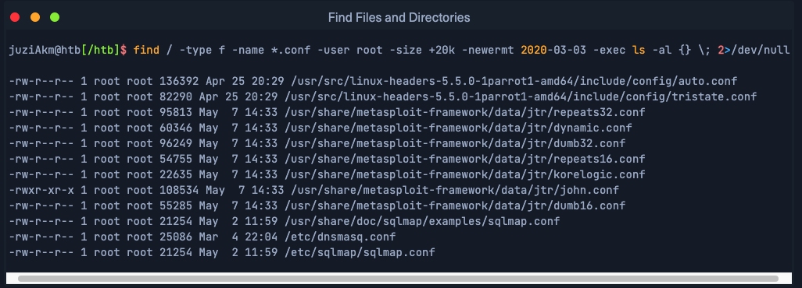
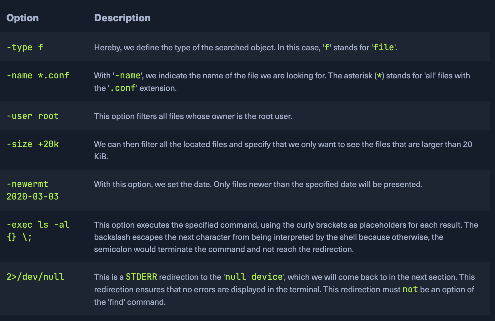

# Learning Dependecies

## 21st, 25th, 26th November 2024
I learned about **Linux**, **Windows OS**, and **Virtual Private Server**. How to install them and make basic configurations. 

### Key Takeaways
- **Linux Navigation**: At first was a personal project started in 1991 by a finnish student Linus Torvalds.
- **Working with files and directories**: Available in over 600 distributions.
- **Editing Files**:
- **Find Files and Directories**:
- **File Descriptions and Redirections**:
- **Filter Contents**:
- **Regular Expressions**:
- **Permission Managment**:

### Reflections
## Linux Navigation
Main commands to navigate in Linux:
-  *pwd* - where am I;
-  *ls* - to list all the contents inside a directory;
to display more information about directories and file I can use an option:
-  *ls -l* - First, we see the total amount of blocks (1024-byte - 1 block) used by the files and directories listed in the current directory, also we see type and permissions, number of hard links to the file/directory, owner, group owner, size or number of blocks, date and time, and finally directory name.
-  *ls -la* - to list all files of a directory, including hidden files that start with a dot at the beginning of its name. 
-  *cd* - we can navigate to the directory and specify the path by adding the path to the specific directory, for instance: cd /dev/shm;
-  *cd -* - to get back to the home directory;
-  *cd /dev/s [TAB x2]* - if I type cd /dev/s and press *TAB* twice it will return all entries with the letter *s* in the directory of /dev/;
-  *cd ..* - to jump to the parent directory, 1 level up in the directory hierarchy;
-  *touch* - to create a file;
-  *mkdir* - to create a directory;
-  *mkdir -p* - to create parent directories;
-  *tree* - to see the whole structure of directories;
-  *touch ./users/tom/readme.txt* - create readme.txt inside tom dir, fram home directory;
-  *mv* - move or rename files and dirs;
-  *rm* - remove files;
-  *rm -r* - remove not empty directory;
-  *rmdir* - remove directory;
-  *nano* file.txt - create text file in Nano editor;
-  *cat* file.txt - to view the contents of the file;  
-  *which* - to return the path to the file or link that should be executed;
-  *find* - to find files and folders, I can use options to define search by parameters: 

 
And here is an explonation of parameters:

-  *locate* - to return file or folders quicker through the system;
-  *find* |wc -l - to count the total number of obtained results;  
-  *find* 2> /dev/null - to redirect the resulting errors to the "null device", which discard all data;
-  *find* 2> /dev/null > file.txt - to redirect standard result to file.txt without resulting errors;
-  *find* 2> stderr.txt 1> stdout.txt - to direct STDOUT ot stdout file, and all resulting error files to STDERR;
-  *ls | grep* ".txt" - in this case ls lists files, and its output is sent to `grep`, which filters for `.txt` files. 
-  *more* displays file content one screen at a time
-  *less* similar to more but allows backward navigation
-  *head* return first 10 lines of the file
-  *tail* return last 10 lines of the file
-  *sort* alphabetically or numerically sort the content of the file to get a better overview
-  *grep -v* search for lines not containing a specific pattern
-  *cut* Extracts specific columns or fields from text
-  *tr* translates or deletes characters
-  *column* formats text into neatly aligned columns
-  *awk* text processing tool for manipulating structured text
-  *sed* stream editor for text manipulation
-  *wc*  counts lines, words, and characters in a file

## Regular Expressions
-  *wc*

**Practical Excersices** 
1. Used this command to resolve the problem: 
`find / -type f -name *.conf -size +25k -size -28k -newermt 2020-03-03 2>/dev/null` 
2. How many total packages are installed on the target system?
`dpkg -l | grep -c '^ii'`
3. How many files exist on the system that have the ".log" file extension?
`find / -type f -name *.log 2> /dev/null |wc -l`
The file we will need to work with is the /etc/passwd file on our target and we can use any shown command above. Our goal is to filter and display only specific contents. Read the file and filter its contents in such a way that we see only:
4. A line with the username cry0l1t3.
`grep "cry0l1t3" /etc/passwd`
5.	The usernames.
`cat /etc/passwd | awk '{print $1}'`
6.	The username cry0l1t3 and his UID.
`grep "cry0l1t3" /etc/passwd | cut -d: -f1,3`
7.	The username cry0l1t3 and his UID separated by a comma (,)
`grep "cry0l1t3" /etc/passwd | cut -d: -f1,3 | tr ':' ','`
8.	The username cry0l1t3, his UID, and the set shell separated by a comma (,)
`awk -F: '/cry0l1t3/ {print $1 "," $3 "," $7}` /etc/passwd
9.	All usernames with their UID and set shells separated by a comma (,).
`awk -F: '{print $1 "," $3 "," $7}' /etc/passwd`
10.	All usernames with their UID and set shells separated by a comma (,) and exclude the ones that contain no logic or false.
`cat /etc/passwd | grep -v "false\|nologin" | awk -F: '{print $1 "," $7}'`
11.	All usernames with their UID and set shells separated by a comma (,) and exclude the ones that contain nologin and count all lines of the filtered output.
`cat /etc/passwd | grep -v "nologin" | awk -F: '{print $1 "," $7} | wc -l'`
12. How many services are listening on the target system on all interfaces? (Not on localhost and IPv4 only)
`ss -l -4 | grep -v "127\.0\.0" | grep "LISTEN" | wc -l`
13. Use cURL from your Pwnbox (not the target machine) to obtain the source code of the "https://www.inlanefreight.com" website and filter all unique paths of that domain. Submit the number of these paths as the answer.
`curl https://www.inlanefreight.com | tr " " “\n” | grep “www.inlanefreight.com” | tr “'” ‘"’ | cut -d’"’ -f2 | sort -u | wc -l`
