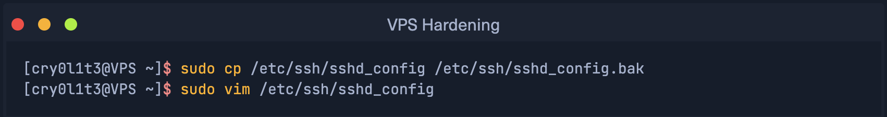
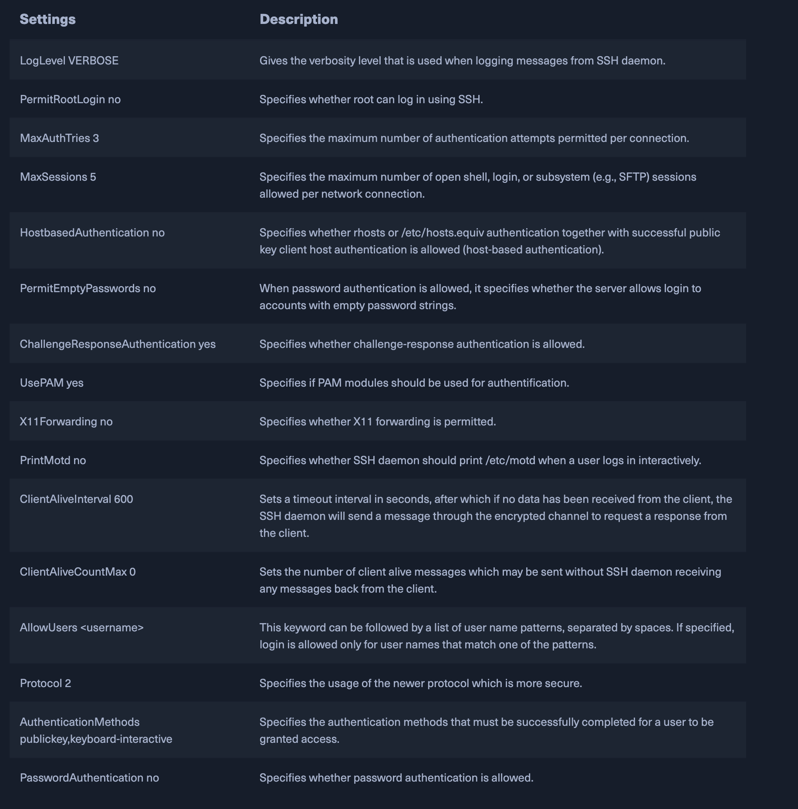

# Learning Dependecies

## 18th & 19th November 2024
Today, I learned about **Linux**, **Windows OS**, and **Virtual Private Server**. How to install them and make basic configurations. 

### Key Takeaways
- **ParrotOS**: One of the most popular penetration testing distribution which I have installed andwill be using during this course.
- **tmux terminal emulator**: Installed on my VMware ParrotOS.
- **Windows**: Installed and set up configuration. 
- **Virtual Private Server**: is an isolated environment created on a physical server using virtualization technology. A VPS is fundamentally part of IaaS solutions.   

### Reflections
I installed ParrotOS in a virtual environment using VMware Fusion. After completing the basic configurations, I set up and updated the repositories in the APT package manager, adding some additional ones as needed, additionally I added custom date and time settings in terminal. However, I encountered an issue with the configuration of `tools.list` that I couldn't resolve. Despite attempting to troubleshoot, I'm still stuck and have decided to leave it for now. I'll revisit the problem once my Linux module begins.

**Windows installation and configurations**
I installed Windows using VMware, adjusted the Execution Policy settings, and set up the Chocolatey Package Manager along with the recommended packages.

**Virtual Private Server**
There are many popular VPS providers:
- Vultr: that will be used during Penetration Testing in this course;
- Linode;
- DigitalOcean;
- OneHostCloud;
Configurated VPS by selecting proper Server - Cloud Compute, Server Location - closest to me, Server Type by selecting OS on the VPS - Parrot OS based on Debian, selecting IPv6 - as additional and recommended feature, generating SSH Keys for secure assymentric encrypted connection, adding new sudo user to differentiate users. 
 Additionally there is a list of recommended settings and precautions for VPS hardening:
- Install Fail2ban;
- Working only with SSH keys;
- Reduce Idle timeout interval;
- Disable passwords;
- Disable x11 forwarding;
- Use a different port;
- Limit users' SSH access;
- Disable root logins;
- Use SSH proto 2;
- Enable 2FA Authentication for SSH;

Available settings and description
