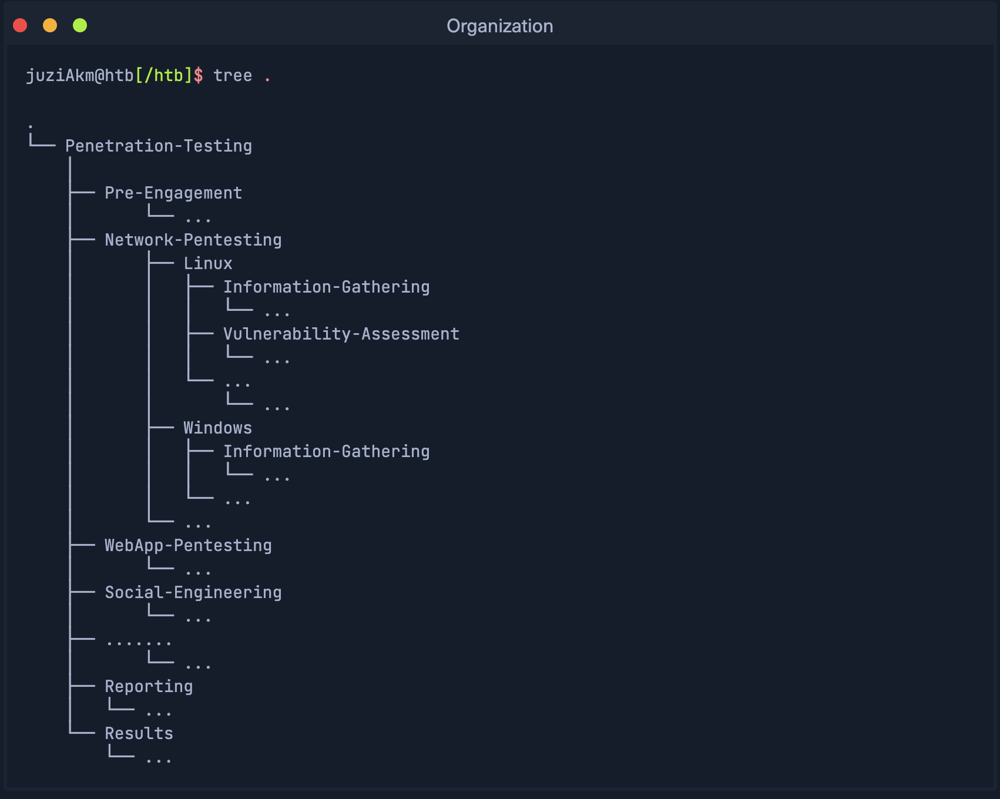
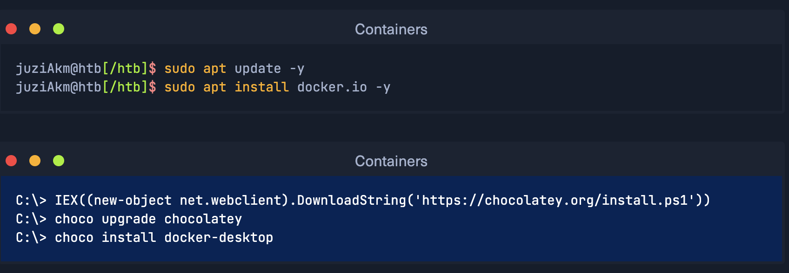
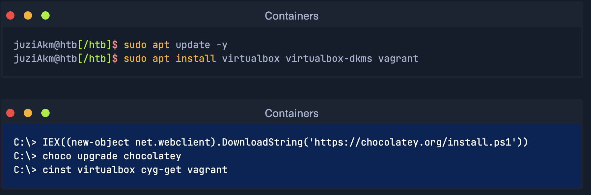

# Learning Dependecies

## 15th November 2024
Today, I learned about how improtant **working environment**, **taking Notes**, and various methods how to manage with passwords. 

## 16th November 2024
I learned about **Virtualization** technologies, why and how to install **Containers**

### Key Takeaways
- **Folder structure**: Proper organization helps us in both keeping track of everything and finding errors in our processes.
- **Importance of a Password Manager**: It's impossible to remember all of our password information, which is why using a Password Manager can be incredibly helpful. Many password managers offer up to 5GB of storage space, 1Password for instance, to securely save all  passwords and authorization details, complete with Multi-Factor Authentication (MFA) for added security.
- **Note Taking**: Taking notes is a crucial part of cybersecurity. We accumulate a lot of details during investigations or penetration testing, and it's impossible to remember everything without proper documentation. 
- **Virtualization**: is an abstraction of physical computing recourses.  

### Reflections

**Folder structure**
Just an example of organization of our folder structure: 

**Note Taking**
There are five different main types of information that need to be noted down:
1. Newly discovered information: such as new IP addresses, usernames, passwords, source code, etc., that we identified and are related to the penetration testing engagement and process. This is information that we can use against our target company. We often obtain such information through OSINT, active scans, and manual analysis of the given information resources and services. 
2. Ideas for further tests and processing We will receive a lot of different information during our penetration testing that will require us to adapt our approach. These results may give us ideas for subsequent steps we can take, and other vulnerabilities or misconfigurations may be forgotten or overlooked. Therefore, we should get in the habit of noting down everything we see that should be investigated as part of the assessment. *Notion.so*, *Obsidian* and *Xmind* are very suitable for this.
3. Scan results: we can use *GhostWriter* or *Pwndoc*. These allow us to generate our documentation and have a clear overview of the steps we have taken.
4. Logging: is essential for both documentation and protection. If third parties attack company during our penetration testing and damage occure, we can prove that the damage did not result from our activities. 
5. Screenshots serve as a momentary record and represent proof of results obtained, necessary for the Proof-Of-Concept and our documentation. One of the best tools for this is *Flameshot*. It has all the essential functions that we need to quickly edit our screenshots without using an additional editing program. We can install it using our APT package manager or via download from Github.

**Virtualization**
VMware Workstation Pro and VMware Workstation Player are most popular virtualization softwares. The Workstation Player can only run one VM at a time. These VMs run only on Windows and Linux OS. For my Mac Os I will going to instal Virtual Box provided by Oracle. 

**Containers**
Container technology allows applications to run in isolated environments, regardless of the underlying system they are deployed on. This isolation makes it easier to develop, deploy, and scale applications:
1. *Simplifies Development*: Containers package all the dependencies an application needs (like libraries, binaries, and configuration files) so that it works the same way across different environments. Developers can be confident that their code will run consistently, whether on a developer's laptop, a testing environment, or in production.
2. *Eases Usage and Deployment*: Since containers are lightweight and portable, applications can be easily deployed and managed across different platforms. This speeds up the process of moving from development to deployment and simplifies the testing and debugging phases.
3. *Enhances Scalability*: Containers can be quickly scaled up or down to meet the demands of an application. You can run multiple containers in parallel and manage them efficiently using container orchestration tools like Apache Mesos or Google Kubernetes.
*Docker* is open-source software that can isolate applications in containerss, similar to operating system virtualization. 
Docker installation:

*Vagrant* is a tool that can create, configure and manage virtual machines or virtual machine environments. 
Docker installation:
